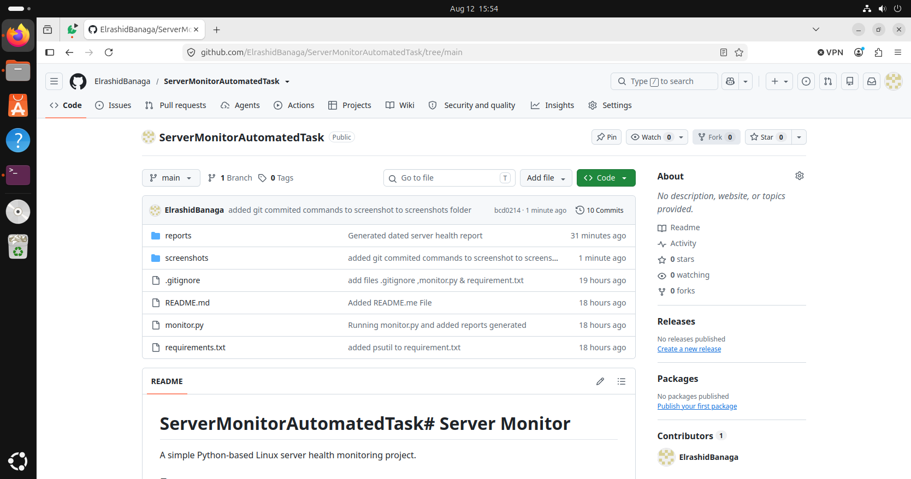

# ServerMonitorAutomatedTask# Server Monitor

A simple Python-based Linux server health monitoring project.

## Features

The script collects:

* Hostname
* Current logged-in user
* Current date and time
* Operating system
* Kernel version
* CPU usage
* Memory usage
* Disk usage
* Primary IP address
* System uptime

The script also automatically generates a daily health report inside the `reports/` directory.

## Project Structure

```text
server-monitor/
├── monitor.py
├── reports/
├── screenshots/
├── README.md
├── .gitignore
└── requirements.txt
```

## Requirements

* Linux
* Python 3
* psutil

## Installation

Clone the repository:

```bash
git clone <your-github-repository-url>
cd server-monitor
```

Install the Python dependency:

```bash
pip3 install -r requirements.txt
```

## Run the Monitor

```bash
python3 monitor.py
```

The report will be saved automatically in:

```text
reports/server-health-YYYY-MM-DD.txt
```

## Example

```text
# SERVER HEALTH REPORT

Hostname: devops-server
Current User: user
Date: 2026-08-11 20:18:00
Operating System: Linux
Kernel: 6.8.0
CPU Usage: 15%

Memory Usage:
Total: 16.00 GB
Used: 6.00 GB
Free: 10.00 GB
Usage: 37%

Disk Usage:
Filesystem: /
Used: 40.00 GB
Available: 110.00 GB
Usage: 27%

IP Address: 192.168.1.100

System Uptime: 2 days, 5 hours, 31 minutes
```
##  Screenshots


